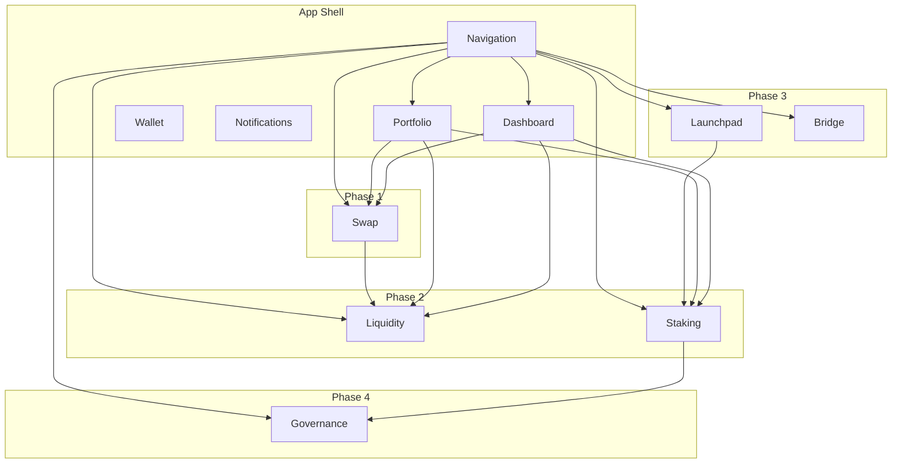

# The Nobody Network – Ecosystem Map

## Product relationship diagram

## Routes

| Route | Product | Phase | Status |
|------|---------|-------|--------|
| `/` | Dashboard | — | Live |
| `/swap` | Swap | 1 | Live |
| `/portfolio` | Portfolio | — | Live |
| `/liquidity` | Liquidity | 2 | Placeholder |
| `/staking` | Staking | 2 | Placeholder |
| `/launchpad` | Launchpad | 3 | Placeholder |
| `/bridge` | Bridge | 3 | Placeholder |
| `/governance` | Governance | 4 | Placeholder |

## Shared capabilities

- **Design system:** Tokens and UI components used by all products.
- **TON Connect:** Single wallet connection for the app.
- **Notifications:** In-app center; future Telegram/email opt-in.
